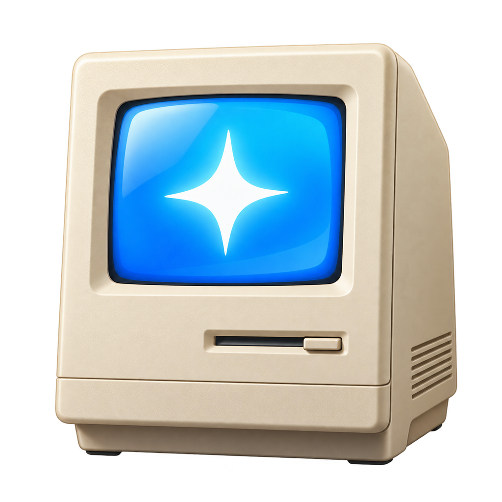

<p align="center">
  
</p>

<h1 align="center">Clean You</h1>

<p align="center">
  <b>A fast, free, open-source Mac cleaner written in Rust.</b><br>
  Reclaim disk space, uninstall apps completely, protect your battery, and keep your Mac quiet and fast.
</p>

<p align="center">
  <a href="https://github.com/luckyklyist/cleanupmacbro/releases/latest"></a>
  
  
  <a href="LICENSE"></a>
</p>

---

## Table of contents

- [Features](#features)
- [Install](#install)
  - [Download the app (recommended)](#option-1-download-the-app-recommended)
  - [Build from source](#option-2-build-from-source)
- [First launch & permissions](#first-launch--permissions)
- [How to use](#how-to-use)
- [Battery Care (charge limit)](#battery-care-charge-limit)
- [Menu bar & Smart Alerts](#menu-bar--smart-alerts)
- [Is it safe?](#is-it-safe)
- [Where Clean You stores things](#where-clean-you-stores-things)
- [Uninstall Clean You](#uninstall-clean-you)
- [Command-line flags](#command-line-flags)
- [Development](#development)
- [Troubleshooting / FAQ](#troubleshooting--faq)
- [Contributing](#contributing)
- [License](#license)

## Features

| | Feature | What it does |
|---|---|---|
| 🧹 | **System Junk** | App caches, logs and package-manager caches. Apps rebuild these automatically. |
| 💻 | **Developer Junk** | `node_modules`, build folders (`.next`, Rust `target`), Python venvs, CocoaPods. Shows how long each project has been idle. |
| 🧠 | **Local AI Models** | Finds models from Ollama, LM Studio, Hugging Face, GPT4All and loose model files. |
| 📦 | **Large Files** | Files and disk images above a size you choose, with Quick Look previews. |
| 👯 | **Duplicates** | Byte-for-byte identical files. One copy of each is always kept. |
| 💿 | **Installers & Downloads** | Leftover `.dmg` / `.pkg` installers and downloads you haven't opened in 90+ days. |
| 🎮 | **Game Library** | Games plus Steam, Epic, CrossOver and Minecraft libraries. |
| 🎬 | **Recordings Hub** | Gathers screen recordings in one folder and can shrink them with ffmpeg (and restore them). |
| 🗺️ | **Disk Map** | Interactive sunburst map of your drive, with snapshots that show what grew since last time. |
| 🗑️ | **App Uninstaller** | Removes apps **together with** their leftovers in `~/Library`, launch agents and helpers. Also finds orphaned files from apps you already deleted. |
| 🔒 | **Privacy** | Clears browser history and cookies (Safari, Chrome, Brave, Edge, Arc…), recent items and the download log. |
| 🚀 | **Startup Items** | See and switch off login items, launch agents and launch daemons. |
| ⚡ | **Performance** | Live CPU / memory, top apps by CPU or RAM, quit hogs, keep-awake timer. |
| 🔋 | **Battery Care** | Battery health and cycles, an **80% charge limit**, heat guard, top-up and discharge-to-limit. |
| 🔔 | **Smart Alerts** | Low-battery reminder, RAM / CPU hog alerts, heat and low-disk warnings, scheduled Smart Clean. |
| 📊 | **Menu bar** | Battery %, charge limit, keep awake and Smart Clean one click away. |

**One-click Smart Clean** only touches things that are safe to remove (caches, logs, rebuildable dev folders).
Everything else is chosen by you and goes to the **Trash** by default, so you can always undo.

## Install

### Option 1: Download the app (recommended)

1. Download **`CleanYou-<version>-macOS.zip`** from the
   **[latest release](https://github.com/luckyklyist/cleanupmacbro/releases/latest)**.
   The app is universal: it runs natively on Apple Silicon (M1–M4) and Intel Macs, macOS 11 Big Sur or newer.
2. Double-click the zip to unpack it, then drag **Clean You.app** into **Applications**.
3. Open it. Because the app is free and not notarized by Apple, macOS will block the first launch.
   Do **one** of the following:
   - **Right-click** (or Control-click) *Clean You.app* → **Open** → **Open**, or
   - go to **System Settings → Privacy & Security**, scroll down and click **Open Anyway**, or
   - run this once in Terminal:

     ```bash
     xattr -dr com.apple.quarantine "/Applications/Clean You.app"
     ```

You only have to do this the first time.

### Option 2: Build from source

Requirements: macOS 11+, [Xcode Command Line Tools](https://developer.apple.com/xcode/resources/) and [Rust](https://rustup.rs).

```bash
xcode-select --install
```

```bash
curl --proto '=https' --tlsv1.2 -sSf https://sh.rustup.rs | sh
```

Then clone and build:

```bash
git clone https://github.com/luckyklyist/cleanupmacbro.git && cd cleanupmacbro
```

```bash
./build_app.sh
```

```bash
mv "Clean You.app" /Applications/
```

`build_app.sh` options:

| Command | Result |
|---|---|
| `./build_app.sh` | Native build for this Mac |
| `UNIVERSAL=1 ./build_app.sh` | One app for Apple Silicon **and** Intel |
| `ZIP=1 ./build_app.sh` | Also writes `dist/CleanYou-<version>-macOS.zip` |

Just want to try it without making an app bundle?

```bash
cargo run --release
```

### Optional: ffmpeg (for shrinking recordings)

The **Recordings Hub** compressor uses ffmpeg. Install it with [Homebrew](https://brew.sh):

```bash
brew install ffmpeg
```

## First launch & permissions

Clean You works without any special permissions, but a few areas can only see everything with **Full Disk Access**
(Safari history, some browser data, Mail downloads, other apps' containers):

1. Open **System Settings → Privacy & Security → Full Disk Access**.
2. Click **+**, choose **Clean You** from Applications, and switch it on.
3. Quit and reopen Clean You.

The Privacy page has a **Full Disk Access** button that jumps straight to that settings screen.

Other prompts you may see, and why:

| Prompt | When | Why |
|---|---|---|
| Administrator password | Turning on the charge limit, removing system-wide apps/daemons | Installing the root charge helper or deleting files owned by root |
| Notifications | Enabling Smart Alerts | Low battery, hog and disk-space alerts |
| Automation / System Events | Quitting apps, managing login items | macOS asks before one app controls another |

## How to use

1. Open **Clean You** and press **Scan** on the Dashboard. The scan runs in the background and fills in each category as it goes.
2. Press **Smart Clean** to remove only the safe, regenerable stuff in one click, **or**
3. Open any category in the sidebar to review items yourself:
   - Click to select, **⇧-click** for a range, **⌘-click** to toggle.
   - Use the search box, the minimum size, and the **"unused for N days"** filter to narrow down.
   - Hover a row for a preview; reveal it in Finder if you're unsure.
4. Press **Delete**. You'll get a confirmation listing exactly what goes and how much space you get back.
   - Normal files go to the **Trash** (recoverable).
   - Caches and dev folders can be removed permanently since they rebuild themselves.
5. The Dashboard's **Activity** card keeps a running total of how much you've freed.

Other pages:

- **Disk Map**: click a ring to zoom into a folder, right-click to reveal or delete. Take a snapshot and come back later to see what grew.
- **Uninstaller**: pick apps (sorted by size or last used), review the leftovers it found, and remove them all together.
- **Privacy**: pick browsers and what to clear. Quit the browser first; Clean You will tell you if it's still running.
- **Startup**: toggle items off to stop them launching. Nothing is uninstalled, you can switch them back on any time.
- **Performance**: see what's eating CPU or memory and quit it; keep the Mac awake for a set time.

## Battery Care (charge limit)

Keeping a lithium battery at 100% all day wears it out faster. Clean You can stop charging at a limit (80% by default),
like AlDente or Apple's Optimized Charging, but predictable.

- **Charge limit**: charging stops at the limit and resumes a little below it ("sailing"), so it doesn't flip on and off.
- **Heat guard**: pauses charging when the battery is hot.
- **Top up**: charge to 100% once, for a trip, then go back to the limit automatically.
- **Discharge to limit**: when plugged in above the limit, run from the battery down to it.

How it works: changing charging needs root, so the first time you turn it on Clean You asks for your admin password and
installs a tiny helper (`/Library/LaunchDaemons/local.cleanyou.charge.plist`) that talks to the Mac's SMC chip.
Settings are kept in `/Users/Shared/CleanYou/charge.conf`.
Turning the limit off restores normal charging, and **Uninstall charge helper** on the Battery page removes it completely.

> The charge limit requires a Mac whose SMC exposes a charging control key (most Apple Silicon and recent Intel MacBooks).
> If yours doesn't, the Battery page says so and the toggle is disabled.

## Menu bar & Smart Alerts

Turn on **Smart Alerts** to install a lightweight background monitor (a per-user LaunchAgent, no password needed). It powers:

- a **menu bar icon** with live battery %, *Limit charging*, *Discharge to limit*, *Keep awake* and *Smart Clean*,
- low-battery reminders and an optional full-screen *"plug in"* lock at a level you choose,
- alerts for apps using too much RAM or CPU, memory pressure, heat, and low disk space,
- optional daily / weekly automatic Smart Clean and a weekly report.

Switch it off again on the Alerts page and the monitor is removed.

## Is it safe?

- **Nothing is deleted without you seeing it**, except what you put in Smart Clean (caches, logs, rebuildable dev folders).
- **Trash first**: user files go to the Trash, not straight to oblivion.
- **No system files**: it never touches `/System` or SIP-protected locations.
- **One copy kept**: duplicate cleanup always keeps at least one copy.
- **No network, no telemetry, no account**. The app never phones home. Read the source; it's ~9k lines of Rust.

## Where Clean You stores things

| Path | What |
|---|---|
| `~/Library/Application Support/CleanYou/` | Settings, cleanup history, disk-map snapshots, monitor binary |
| `~/Library/Caches/CleanYou/thumbs/` | Preview thumbnail cache |
| `~/Library/LaunchAgents/local.cleanyou.agent.plist` | Background monitor (only if Smart Alerts is on) |
| `/Library/LaunchDaemons/local.cleanyou.charge.plist` | Charge-limit helper (only if the charge limit is on) |
| `/Library/Application Support/CleanYou/clean-you-helper` | Charge-limit helper binary |
| `/Users/Shared/CleanYou/` | Charge-limit settings and status shared with the helper |

## Uninstall Clean You

The easy way: turn off **Smart Alerts** and click **Uninstall charge helper** on the Battery page, then drag the app to the Trash.

Or remove everything by hand:

```bash
launchctl bootout gui/$(id -u)/local.cleanyou.agent 2>/dev/null; rm -f ~/Library/LaunchAgents/local.cleanyou.agent.plist
```

```bash
sudo "/Library/Application Support/CleanYou/clean-you-helper" --charge-reset; sudo launchctl bootout system/local.cleanyou.charge; sudo rm -rf /Library/LaunchDaemons/local.cleanyou.charge.plist "/Library/Application Support/CleanYou" /Users/Shared/CleanYou
```

```bash
rm -rf "/Applications/Clean You.app" ~/Library/Application\ Support/CleanYou ~/Library/Caches/CleanYou
```

## Command-line flags

The same binary runs the app, the monitor and the helper:

| Flag | Purpose |
|---|---|
| *(none)* | Open the app |
| `--agent` | Run the background monitor + menu bar icon (used by the LaunchAgent) |
| `--charge-daemon` | Run the root charge-limit helper (used by the LaunchDaemon) |
| `--charge-reset` | Re-enable normal charging and exit |
| `--plug-in [--preview]` | Show the full-screen "plug in your charger" lock |
| `--smc-read KEY…` | Debug: read raw SMC keys and report the charging key |

## Development

```bash
cargo run              # debug build
cargo test             # unit tests (scanning, deletion, uninstaller matching, charge logic…)
cargo clippy           # lints
```

Project layout:

```
src/
  main.rs        app shell, sidebar, dashboard, category lists, delete flow
  scan.rs        background scanner, categories, Smart Clean, trash/delete
  diskmap.rs     sunburst disk map + snapshots
  uninstall.rs   app uninstaller and leftover finder
  privacy.rs     browser history, cookies, recent items
  startup.rs     login items, launch agents and daemons
  system.rs      CPU / memory / disk sampling, keep awake
  video.rs       ffmpeg compress / restore for recordings
  thumbs.rs      Quick Look thumbnails and app icons
  battery.rs     battery info, charge-limit logic, root helper
  smc.rs         minimal Apple SMC client via IOKit
  care.rs        Battery Care and Smart Alerts pages
  agent.rs       background monitor (LaunchAgent), notifications
  tray.rs        menu bar icon
assets/          app icon
build_app.sh     builds "Clean You.app" (and a release zip)
```

Built with [egui/eframe](https://github.com/emilk/egui), [Phosphor icons](https://phosphoricons.com),
[walkdir](https://crates.io/crates/walkdir), [trash](https://crates.io/crates/trash) and [tray-icon](https://crates.io/crates/tray-icon).

### Releasing

Bump `version` in `Cargo.toml`, then build the universal zip and publish it:

```bash
UNIVERSAL=1 ZIP=1 ./build_app.sh
```

```bash
gh release create v0.1.0 dist/CleanYou-0.1.0-macOS.zip --generate-notes
```

## Troubleshooting / FAQ

**"Clean You is damaged and can't be opened" / "cannot be opened because the developer cannot be verified".**
That's Gatekeeper on an un-notarized download. Run `xattr -dr com.apple.quarantine "/Applications/Clean You.app"` or use right-click → Open.

**Some categories look empty or Privacy says "Needs Full Disk Access".**
Grant Full Disk Access (see [First launch & permissions](#first-launch--permissions)) and reopen the app.

**The charge limit toggle is greyed out.**
Your Mac's SMC doesn't expose a supported charging key. Run `"/Applications/Clean You.app/Contents/MacOS/clean-you" --smc-read` and open an issue with the output.

**My battery stays at 100% / won't charge after uninstalling.**
Run `sudo "/Library/Application Support/CleanYou/clean-you-helper" --charge-reset` if the helper is still there, or simply restart the Mac: the SMC resets to normal charging.

**Recordings compression says ffmpeg is missing.**
`brew install ffmpeg`, then reopen the page.

## Contributing

Bug reports, ideas and pull requests are welcome! See [CONTRIBUTING.md](CONTRIBUTING.md).
Please keep it native, fast and dependency-light, and never add telemetry.

## License

[MIT](LICENSE) © luckyklyist
